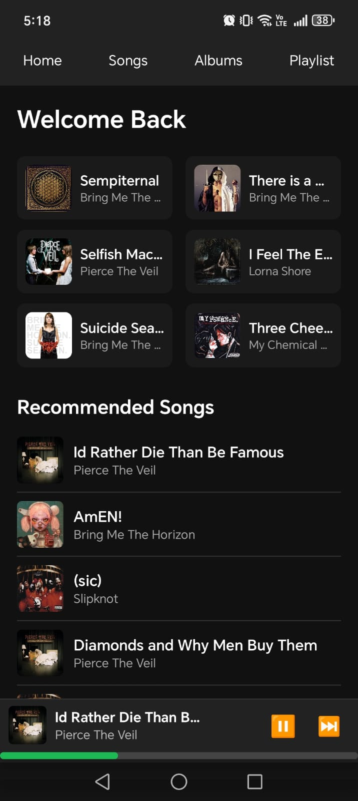
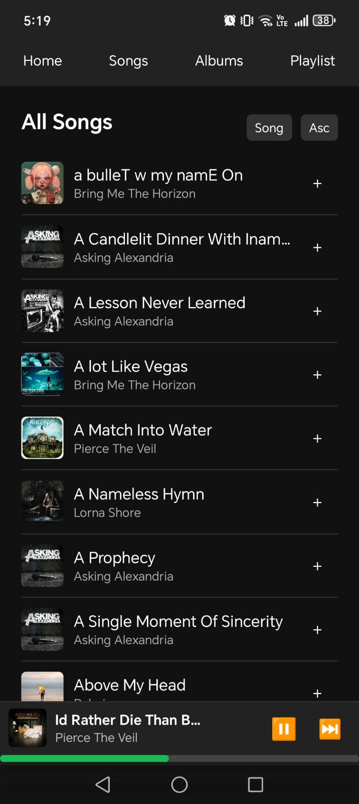
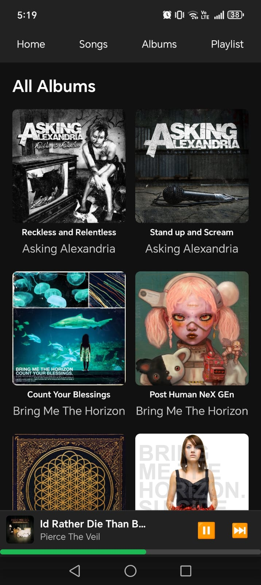
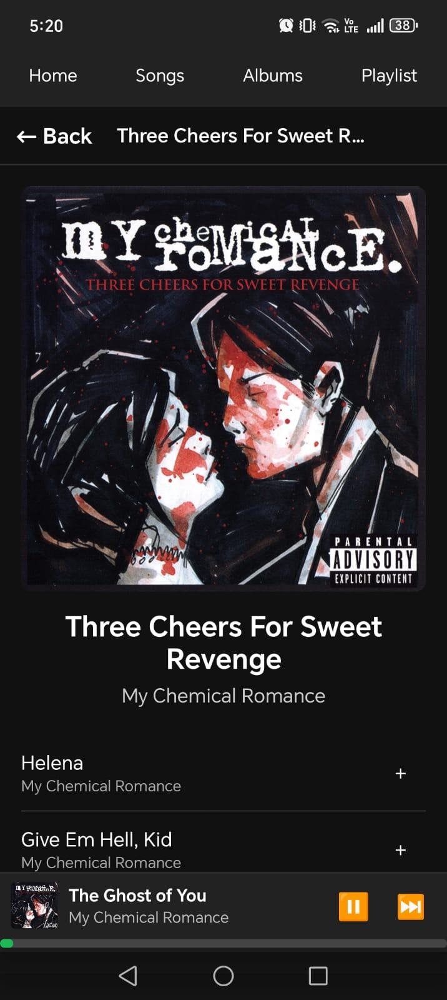
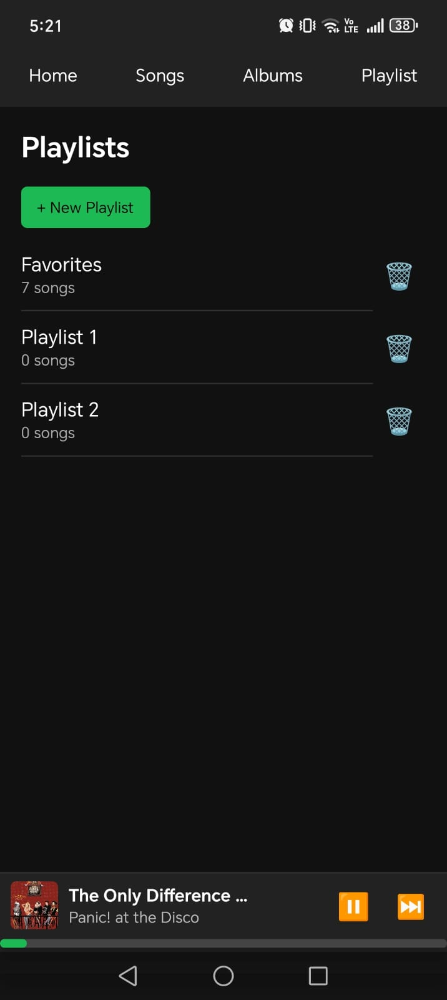
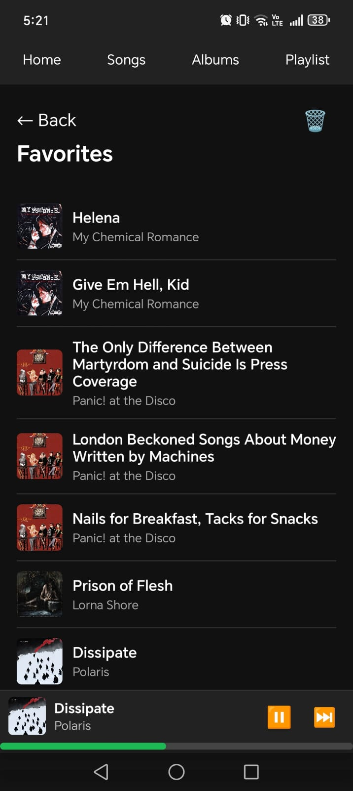

# **SPunktify**
A mobile application inspired by Spotify, built with **React Native + Expo**.


<p align="center">
  
  
  
  
  
  
</p>

---

## **Installation**

### Dependencies

```bash
├── @react-native-async-storage/async-storage@2.2.0
├── @react-native-community/slider@5.1.1
├── @react-navigation/native-stack@7.6.4
├── @react-navigation/native@7.1.21
├── @supabase/supabase-js@2.86.0
├── add@2.0.6
├── AsyncStorage@0.1.5
├── concurrently@9.2.1
├── cors@2.8.5
├── expo-av@16.0.7
├── expo-dev-client@6.0.18
├── expo-status-bar@3.0.8
├── expo@54.0.25
├── express@5.1.0
├── react-dom@19.1.0
├── react-native-safe-area-context@5.6.2
├── react-native-screens@4.18.0
├── react-native-web@0.21.2
├── react-native@0.81.5
└── react@19.1.0
```
The music its located on an external server on supabase.com

## run generate script that is located in /data/generate.js
  ```bash
SPunktify> cd data
SPunktify/data> node generate.js
[LOG] Listo! JSONs generados ✔   (JSONs generated)
```
    

## Start Expo GO or install APK
```bash
SPunktify> npx expo start

or

go to https://expo.dev/accounts/sircrls/projects/SPunktify/builds/b4adba4c-ce43-4dc5-9234-496d9bf44ede and install APK
```
For now, I think its everything you need to do for you to run SPunktify locally. Thanks.

